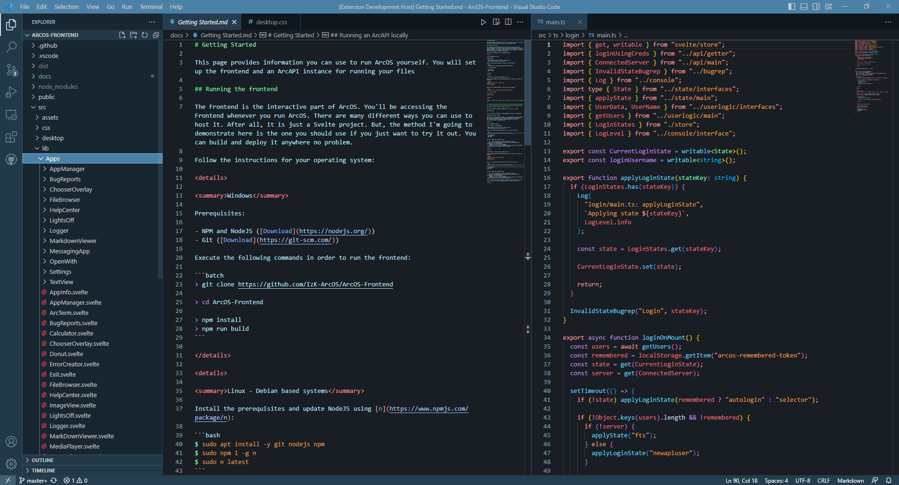

# A Theme for VSCode to look more like ArcOS.
## Authors: Blockyheadman, IzKupiers
Ever wanted a new style for Visual Studio Code? Well now you can have one similar to ArcOS featuring colors used inside the virtual OS made in Svelte!

This Theme changes the entire feel of VSCode by using colors as seen in ArcOS. It uses the ArcOS blue to express itself everywhere.
Code looks great as well in this theme so no need to worry about reading issues or colors confusing you.

It's currently a small project but would be greatly appriciated if you supported the project by using it and adding to it!

**Big thanks to [@IzKuipers](https://github.com/IzKuipers) for allowing me create this theme! Go check out the [ArcOS](https://izk-arcos.nl/) project that he and the ArcOS team created!**

###### ArcOS is a virtual Operating System (OS) that is made using Svelte and typescript.
###### **The 'ArcOS Stable' icon is licensed under the <ins>[GPLv3 License](https://www.gnu.org/licenses/gpl-3.0.en.html#license-text)</ins>**
